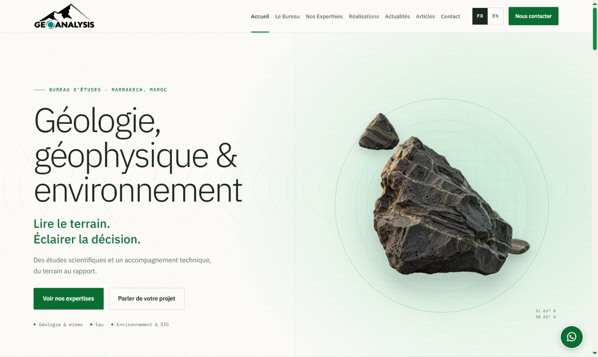

# GEOANALYSIS

### Geology, geophysics & environmental studies · Marrakech, Morocco

**Read the ground. Inform the decision.** GEOANALYSIS is a bilingual website and content-management platform for a geoscience consultancy based in Marrakech. It presents the firm’s expertise, field assignments, and geoscience resources in French and English.



*French homepage hero at 1440 × 860, with the rock illustrations in frame.*

## The experience

- Responsive French and English pages for geology and mining, water, environment, and GIS services.
- Project pages that present field assignments and technical work.
- News and geoscience articles with archive and detail pages.
- Contact form and WhatsApp contact link.
- Protected admin area for managing site content, projects, team members, partners, incoming messages, and settings.

## Built with

Next.js 16 · React 19 · TypeScript · Tailwind CSS 4 · Motion · Neon Auth · Neon Postgres · Cloudinary · Nodemailer

## Routes

| Route | Purpose |
| --- | --- |
| `/` | Redirects to the French homepage |
| `/[lang]` | Homepage in French (`fr`) or English (`en`) |
| `/[lang]/expertises` | Expertise directory and service details |
| `/[lang]/realisations` | Project archive and project details |
| `/[lang]/actualites` | News archive and articles |
| `/[lang]/articles` | Geoscience guides and analysis |
| `/[lang]/bureau` | Firm profile and team |
| `/[lang]/contact` | Project inquiry form and contact details |
| `/admin` | Admin sign-in and protected content-management area |

## Run locally

Create `.env.local` from the example file and configure the services you need. `DATABASE_URL` is required to create the CMS tables. Neon Auth powers admin sign-in; Cloudinary handles media uploads; Gmail credentials enable contact email notifications.

```bash
cp .env.example .env.local
npm install
npm run db:migrate
npm run dev
```

Open [http://localhost:3000](http://localhost:3000). The site redirects to `/fr` by default.

To create the initial admin account, configure `NEON_AUTH_BASE_URL` and run `npm run admin:create`. The generated credentials are saved in the ignored `.env.admin-credentials` file.

## Useful commands

```bash
npm run lint          # Check source with ESLint
npm run test:security # Run security checks
npm run build         # Create a production build
npm run start         # Serve the production build
```

## Project structure

```text
app/         Public pages, admin pages, and API routes
components/  Site sections, shared UI, and admin content editors
lib/         Content, localization, and server integrations
public/      Brand assets, photography, and README screenshot
scripts/     Database and admin setup utilities
tests/       Security checks
```

## Credits

Designed and built by [Yassine Joundi](https://github.com/yassinejoundi) for GEOANALYSIS.
